<!-- GENERATED BY SEQUENCE HUMAN VIEW - DO NOT EDIT -->

# SW2-08-GOVERNANCE — Human Sequence View

> This diagram is a deterministic **static structural projection**. It collapses helper-level calls into semantic modules for readability. It does **not** prove runtime ordering and does not replace the full machine evidence.

## Evidence

- Machine graph: [docs/sequence/generated/SW2-08-GOVERNANCE.actual.json](../../../docs/sequence/generated/SW2-08-GOVERNANCE.actual.json)
- Full machine Mermaid: [docs/sequence/generated/SW2-08-GOVERNANCE.actual.mmd](../../../docs/sequence/generated/SW2-08-GOVERNANCE.actual.mmd)
- Human projection data: [docs/sequence/generated/SW2-08-GOVERNANCE.human.json](../../../docs/sequence/generated/SW2-08-GOVERNANCE.human.json)
- Source digest: `7a03100586c7b394b50ebc4dcbb6a3da4c39cfcf102be83069e154f127866c71`

## Complexity

| Metric | Machine | Human |
|---|---:|---:|
| Participants / nodes | 88 | 14 |
| Interactions / edges | 146 | 24 |
| Internal machine edges collapsed | 88 | — |
| Cross-component edges aggregated | 34 | — |

Policy `module-collapse-v1`: one participant per semantic module/external boundary and one rendered interaction per directed component pair. The ceilings are derived from the graph itself; this policy does not invent a global numeric readability limit.

## Diagram

```mermaid
sequenceDiagram
    participant module_scripts_analyzer_contract_py_0 as scripts/analyzer_contract.py
    participant module_scripts_benchmark_governance_py_1 as scripts/benchmark_governance.py
    participant module_scripts_extract_project_facts_py_2 as scripts/extract_project_facts.py
    participant module_scripts_governance_engine_py_3 as scripts/governance_engine.py
    participant module_scripts_initialize_project_truth_py_4 as scripts/initialize_project_truth.py
    participant module_scripts_migrate_governance_v1_py_5 as scripts/migrate_governance_v1.py
    participant module_scripts_project_profile_py_6 as scripts/project_profile.py
    participant module_scripts_project_snapshot_py_7 as scripts/project_snapshot.py
    participant module_scripts_schema_contract_py_8 as scripts/schema_contract.py
    participant module_scripts_script_runner_py_9 as scripts/script_runner.py
    participant module_scripts_selftest_sequence_human_view_py_10 as scripts/selftest_sequence_human_view.py
    participant module_scripts_selftest_strict_project_workflow_py_11 as scripts/selftest_strict_project_workflow.py
    participant module_scripts_sequence_contract_py_12 as scripts/sequence_contract.py
    participant module_scripts_toolchain_identity_py_13 as scripts/toolchain_identity.py
    module_scripts_benchmark_governance_py_1->>module_scripts_extract_project_facts_py_2: 2 static interactions
    module_scripts_benchmark_governance_py_1->>module_scripts_project_snapshot_py_7: 5 static interactions
    module_scripts_benchmark_governance_py_1->>module_scripts_sequence_contract_py_12: 1 static interaction
    module_scripts_extract_project_facts_py_2->>module_scripts_analyzer_contract_py_0: 5 static interactions
    module_scripts_extract_project_facts_py_2->>module_scripts_governance_engine_py_3: 1 static interaction
    module_scripts_extract_project_facts_py_2->>module_scripts_project_snapshot_py_7: 3 static interactions
    module_scripts_governance_engine_py_3->>module_scripts_project_snapshot_py_7: 4 static interactions
    module_scripts_governance_engine_py_3->>module_scripts_script_runner_py_9: 1 static interaction
    module_scripts_initialize_project_truth_py_4->>module_scripts_project_snapshot_py_7: 1 static interaction
    module_scripts_initialize_project_truth_py_4->>module_scripts_toolchain_identity_py_13: 1 static interaction
    module_scripts_migrate_governance_v1_py_5->>module_scripts_project_profile_py_6: 2 static interactions
    module_scripts_migrate_governance_v1_py_5->>module_scripts_project_snapshot_py_7: 3 static interactions
    module_scripts_migrate_governance_v1_py_5->>module_scripts_schema_contract_py_8: 5 static interactions
    module_scripts_migrate_governance_v1_py_5->>module_scripts_toolchain_identity_py_13: 3 static interactions
    module_scripts_project_profile_py_6->>module_scripts_project_snapshot_py_7: 1 static interaction
    module_scripts_project_profile_py_6->>module_scripts_schema_contract_py_8: 1 static interaction
    module_scripts_project_snapshot_py_7->>module_scripts_selftest_sequence_human_view_py_10: 1 static interaction
    module_scripts_schema_contract_py_8->>module_scripts_project_snapshot_py_7: 1 static interaction
    module_scripts_selftest_sequence_human_view_py_10->>module_scripts_project_snapshot_py_7: 1 static interaction
    module_scripts_selftest_strict_project_workflow_py_11->>module_scripts_project_snapshot_py_7: 5 static interactions
    module_scripts_sequence_contract_py_12->>module_scripts_project_snapshot_py_7: 3 static interactions
    module_scripts_sequence_contract_py_12->>module_scripts_selftest_sequence_human_view_py_10: 1 static interaction
    module_scripts_toolchain_identity_py_13->>module_scripts_project_snapshot_py_7: 5 static interactions
    module_scripts_toolchain_identity_py_13->>module_scripts_selftest_sequence_human_view_py_10: 2 static interactions
```

