<!-- GENERATED BY SEQUENCE HUMAN VIEW - DO NOT EDIT -->

# SW2-09-GOVERNANCE — Human Sequence View

> This diagram is a deterministic **static structural projection**. It collapses helper-level calls into semantic modules for readability. It does **not** prove runtime ordering and does not replace the full machine evidence.

## Evidence

- Machine graph: [docs/sequence/generated/SW2-09-GOVERNANCE.actual.json](../../../docs/sequence/generated/SW2-09-GOVERNANCE.actual.json)
- Full machine Mermaid: [docs/sequence/generated/SW2-09-GOVERNANCE.actual.mmd](../../../docs/sequence/generated/SW2-09-GOVERNANCE.actual.mmd)
- Human projection data: [docs/sequence/generated/SW2-09-GOVERNANCE.human.json](../../../docs/sequence/generated/SW2-09-GOVERNANCE.human.json)
- Source digest: `1bfcb37f418b36357867879fc9d99b140a38c98d8cf4a3ae896c44b490a4ed13`

## Complexity

| Metric | Machine | Human |
|---|---:|---:|
| Participants / nodes | 73 | 14 |
| Interactions / edges | 116 | 21 |
| Internal machine edges collapsed | 71 | — |
| Cross-component edges aggregated | 24 | — |

Policy `module-collapse-v1`: one participant per semantic module/external boundary and one rendered interaction per directed component pair. The ceilings are derived from the graph itself; this policy does not invent a global numeric readability limit.

## Diagram

```mermaid
sequenceDiagram
    participant module_scripts_governance_engine_py_0 as scripts/governance_engine.py
    participant module_scripts_project_profile_py_1 as scripts/project_profile.py
    participant module_scripts_project_snapshot_py_2 as scripts/project_snapshot.py
    participant module_scripts_release_preflight_py_3 as scripts/release_preflight.py
    participant module_scripts_schema_contract_py_4 as scripts/schema_contract.py
    participant module_scripts_script_runner_py_5 as scripts/script_runner.py
    participant module_scripts_selftest_adoption_profiles_py_6 as scripts/selftest_adoption_profiles.py
    participant module_scripts_selftest_sequence_human_view_py_7 as scripts/selftest_sequence_human_view.py
    participant module_scripts_toolchain_identity_py_8 as scripts/toolchain_identity.py
    participant module_scripts_validate_doc_quality_py_9 as scripts/validate_doc_quality.py
    participant module_scripts_validate_handoff_py_10 as scripts/validate_handoff.py
    participant module_scripts_validate_project_truth_py_11 as scripts/validate_project_truth.py
    participant module_scripts_validate_public_docs_py_12 as scripts/validate_public_docs.py
    participant module_scripts_validate_schema_toolchain_py_13 as scripts/validate_schema_toolchain.py
    module_scripts_governance_engine_py_0->>module_scripts_project_snapshot_py_2: 4 static interactions
    module_scripts_governance_engine_py_0->>module_scripts_script_runner_py_5: 1 static interaction
    module_scripts_project_profile_py_1->>module_scripts_project_snapshot_py_2: 1 static interaction
    module_scripts_project_profile_py_1->>module_scripts_schema_contract_py_4: 1 static interaction
    module_scripts_project_snapshot_py_2->>module_scripts_selftest_sequence_human_view_py_7: 1 static interaction
    module_scripts_release_preflight_py_3->>module_scripts_project_snapshot_py_2: 1 static interaction
    module_scripts_schema_contract_py_4->>module_scripts_project_snapshot_py_2: 1 static interaction
    module_scripts_script_runner_py_5->>module_scripts_selftest_adoption_profiles_py_6: 1 static interaction
    module_scripts_selftest_sequence_human_view_py_7->>module_scripts_project_snapshot_py_2: 1 static interaction
    module_scripts_toolchain_identity_py_8->>module_scripts_project_snapshot_py_2: 2 static interactions
    module_scripts_toolchain_identity_py_8->>module_scripts_selftest_sequence_human_view_py_7: 2 static interactions
    module_scripts_validate_handoff_py_10->>module_scripts_project_profile_py_1: 7 static interactions
    module_scripts_validate_handoff_py_10->>module_scripts_project_snapshot_py_2: 3 static interactions
    module_scripts_validate_project_truth_py_11->>module_scripts_project_profile_py_1: 7 static interactions
    module_scripts_validate_project_truth_py_11->>module_scripts_project_snapshot_py_2: 3 static interactions
    module_scripts_validate_project_truth_py_11->>module_scripts_script_runner_py_5: 1 static interaction
    module_scripts_validate_public_docs_py_12->>module_scripts_project_snapshot_py_2: 4 static interactions
    module_scripts_validate_public_docs_py_12->>module_scripts_validate_doc_quality_py_9: 1 static interaction
    module_scripts_validate_schema_toolchain_py_13->>module_scripts_project_profile_py_1: 1 static interaction
    module_scripts_validate_schema_toolchain_py_13->>module_scripts_schema_contract_py_4: 1 static interaction
    module_scripts_validate_schema_toolchain_py_13->>module_scripts_toolchain_identity_py_8: 1 static interaction
```

