<!-- GENERATED BY SEQUENCE HUMAN VIEW - DO NOT EDIT -->

# SW2-11-GOVERNANCE — Human Sequence View

> This diagram is a deterministic **static structural projection**. It collapses helper-level calls into semantic modules for readability. It does **not** prove runtime ordering and does not replace the full machine evidence.

## Evidence

- Machine graph: [docs/sequence/generated/SW2-11-GOVERNANCE.actual.json](../../../docs/sequence/generated/SW2-11-GOVERNANCE.actual.json)
- Full machine Mermaid: [docs/sequence/generated/SW2-11-GOVERNANCE.actual.mmd](../../../docs/sequence/generated/SW2-11-GOVERNANCE.actual.mmd)
- Human projection data: [docs/sequence/generated/SW2-11-GOVERNANCE.human.json](../../../docs/sequence/generated/SW2-11-GOVERNANCE.human.json)
- Source digest: `058d6c15e4043b9ad527079f05e7670cd021ee48ae99d8ef4e44c51f6a989ef9`

## Complexity

| Metric | Machine | Human |
|---|---:|---:|
| Participants / nodes | 71 | 14 |
| Interactions / edges | 114 | 26 |
| Internal machine edges collapsed | 62 | — |
| Cross-component edges aggregated | 26 | — |

Policy `module-collapse-v1`: one participant per semantic module/external boundary and one rendered interaction per directed component pair. The ceilings are derived from the graph itself; this policy does not invent a global numeric readability limit.

## Diagram

```mermaid
sequenceDiagram
    participant module_scripts_governance_engine_py_0 as scripts/governance_engine.py
    participant module_scripts_initialize_project_truth_py_1 as scripts/initialize_project_truth.py
    participant module_scripts_migrate_governance_v1_py_2 as scripts/migrate_governance_v1.py
    participant module_scripts_project_profile_py_3 as scripts/project_profile.py
    participant module_scripts_project_snapshot_py_4 as scripts/project_snapshot.py
    participant module_scripts_schema_contract_py_5 as scripts/schema_contract.py
    participant module_scripts_script_runner_py_6 as scripts/script_runner.py
    participant module_scripts_selftest_sequence_human_view_py_7 as scripts/selftest_sequence_human_view.py
    participant module_scripts_sync_project_truth_py_8 as scripts/sync_project_truth.py
    participant module_scripts_toolchain_identity_py_9 as scripts/toolchain_identity.py
    participant module_scripts_validate_doc_quality_py_10 as scripts/validate_doc_quality.py
    participant module_scripts_validate_project_docs_py_11 as scripts/validate_project_docs.py
    participant module_scripts_validate_repository_health_py_12 as scripts/validate_repository_health.py
    participant module_scripts_validate_sequence_sessions_py_13 as scripts/validate_sequence_sessions.py
    module_scripts_governance_engine_py_0->>module_scripts_project_snapshot_py_4: 4 static interactions
    module_scripts_governance_engine_py_0->>module_scripts_script_runner_py_6: 1 static interaction
    module_scripts_initialize_project_truth_py_1->>module_scripts_project_snapshot_py_4: 1 static interaction
    module_scripts_initialize_project_truth_py_1->>module_scripts_toolchain_identity_py_9: 1 static interaction
    module_scripts_migrate_governance_v1_py_2->>module_scripts_project_profile_py_3: 2 static interactions
    module_scripts_migrate_governance_v1_py_2->>module_scripts_project_snapshot_py_4: 4 static interactions
    module_scripts_migrate_governance_v1_py_2->>module_scripts_schema_contract_py_5: 5 static interactions
    module_scripts_migrate_governance_v1_py_2->>module_scripts_toolchain_identity_py_9: 3 static interactions
    module_scripts_project_profile_py_3->>module_scripts_project_snapshot_py_4: 1 static interaction
    module_scripts_project_profile_py_3->>module_scripts_schema_contract_py_5: 1 static interaction
    module_scripts_project_snapshot_py_4->>module_scripts_selftest_sequence_human_view_py_7: 1 static interaction
    module_scripts_schema_contract_py_5->>module_scripts_project_snapshot_py_4: 1 static interaction
    module_scripts_selftest_sequence_human_view_py_7->>module_scripts_project_snapshot_py_4: 1 static interaction
    module_scripts_sync_project_truth_py_8->>module_scripts_project_profile_py_3: 2 static interactions
    module_scripts_sync_project_truth_py_8->>module_scripts_project_snapshot_py_4: 4 static interactions
    module_scripts_sync_project_truth_py_8->>module_scripts_script_runner_py_6: 1 static interaction
    module_scripts_toolchain_identity_py_9->>module_scripts_project_snapshot_py_4: 5 static interactions
    module_scripts_toolchain_identity_py_9->>module_scripts_selftest_sequence_human_view_py_7: 2 static interactions
    module_scripts_validate_project_docs_py_11->>module_scripts_project_profile_py_3: 2 static interactions
    module_scripts_validate_project_docs_py_11->>module_scripts_project_snapshot_py_4: 1 static interaction
    module_scripts_validate_project_docs_py_11->>module_scripts_script_runner_py_6: 1 static interaction
    module_scripts_validate_project_docs_py_11->>module_scripts_validate_doc_quality_py_10: 1 static interaction
    module_scripts_validate_repository_health_py_12->>module_scripts_project_snapshot_py_4: 3 static interactions
    module_scripts_validate_repository_health_py_12->>module_scripts_validate_doc_quality_py_10: 1 static interaction
    module_scripts_validate_sequence_sessions_py_13->>module_scripts_project_profile_py_3: 2 static interactions
    module_scripts_validate_sequence_sessions_py_13->>module_scripts_project_snapshot_py_4: 1 static interaction
```

