<!-- GENERATED BY SEQUENCE HUMAN VIEW - DO NOT EDIT -->

# SW2-19-GOVERNANCE — Human Sequence View

> This diagram is a deterministic **static structural projection**. It collapses helper-level calls into semantic modules for readability. It does **not** prove runtime ordering and does not replace the full machine evidence.

## Evidence

- Machine graph: [docs/sequence/generated/SW2-19-GOVERNANCE.actual.json](../../../docs/sequence/generated/SW2-19-GOVERNANCE.actual.json)
- Full machine Mermaid: [docs/sequence/generated/SW2-19-GOVERNANCE.actual.mmd](../../../docs/sequence/generated/SW2-19-GOVERNANCE.actual.mmd)
- Human projection data: [docs/sequence/generated/SW2-19-GOVERNANCE.human.json](../../../docs/sequence/generated/SW2-19-GOVERNANCE.human.json)
- Source digest: `7123cbf57af40314316e1b63cd5233a306f10fd03b305918fdd098f42345f986`

## Complexity

| Metric | Machine | Human |
|---|---:|---:|
| Participants / nodes | 97 | 13 |
| Interactions / edges | 159 | 24 |
| Internal machine edges collapsed | 115 | — |
| Cross-component edges aggregated | 20 | — |

Policy `module-collapse-v1`: one participant per semantic module/external boundary and one rendered interaction per directed component pair. The ceilings are derived from the graph itself; this policy does not invent a global numeric readability limit.

## Diagram

```mermaid
sequenceDiagram
    participant module_scripts_governance_engine_py_0 as scripts/governance_engine.py
    participant module_scripts_project_profile_py_1 as scripts/project_profile.py
    participant module_scripts_project_snapshot_py_2 as scripts/project_snapshot.py
    participant module_scripts_release_preflight_py_3 as scripts/release_preflight.py
    participant module_scripts_schema_contract_py_4 as scripts/schema_contract.py
    participant module_scripts_script_runner_py_5 as scripts/script_runner.py
    participant module_scripts_selftest_adoption_profiles_py_6 as scripts/selftest_adoption_profiles.py
    participant module_scripts_selftest_sequence_human_view_py_7 as scripts/selftest_sequence_human_view.py
    participant module_scripts_sync_project_truth_py_8 as scripts/sync_project_truth.py
    participant module_scripts_validate_cross_document_consistency_py_9 as scripts/validate_cross_document_consistency.py
    participant module_scripts_validate_doc_quality_py_10 as scripts/validate_doc_quality.py
    participant module_scripts_validate_project_docs_py_11 as scripts/validate_project_docs.py
    participant module_scripts_validate_sequence_sessions_py_12 as scripts/validate_sequence_sessions.py
    module_scripts_governance_engine_py_0->>module_scripts_project_snapshot_py_2: 4 static interactions
    module_scripts_governance_engine_py_0->>module_scripts_script_runner_py_5: 1 static interaction
    module_scripts_governance_engine_py_0->>module_scripts_validate_sequence_sessions_py_12: 2 static interactions
    module_scripts_project_profile_py_1->>module_scripts_project_snapshot_py_2: 1 static interaction
    module_scripts_project_profile_py_1->>module_scripts_schema_contract_py_4: 1 static interaction
    module_scripts_project_profile_py_1->>module_scripts_validate_sequence_sessions_py_12: 1 static interaction
    module_scripts_project_snapshot_py_2->>module_scripts_selftest_sequence_human_view_py_7: 1 static interaction
    module_scripts_release_preflight_py_3->>module_scripts_project_snapshot_py_2: 1 static interaction
    module_scripts_release_preflight_py_3->>module_scripts_validate_sequence_sessions_py_12: 1 static interaction
    module_scripts_script_runner_py_5->>module_scripts_selftest_adoption_profiles_py_6: 1 static interaction
    module_scripts_selftest_sequence_human_view_py_7->>module_scripts_project_snapshot_py_2: 1 static interaction
    module_scripts_sync_project_truth_py_8->>module_scripts_project_profile_py_1: 2 static interactions
    module_scripts_sync_project_truth_py_8->>module_scripts_project_snapshot_py_2: 4 static interactions
    module_scripts_sync_project_truth_py_8->>module_scripts_script_runner_py_5: 1 static interaction
    module_scripts_validate_cross_document_consistency_py_9->>module_scripts_project_profile_py_1: 7 static interactions
    module_scripts_validate_cross_document_consistency_py_9->>module_scripts_project_snapshot_py_2: 1 static interaction
    module_scripts_validate_cross_document_consistency_py_9->>module_scripts_validate_sequence_sessions_py_12: 3 static interactions
    module_scripts_validate_project_docs_py_11->>module_scripts_project_profile_py_1: 2 static interactions
    module_scripts_validate_project_docs_py_11->>module_scripts_project_snapshot_py_2: 1 static interaction
    module_scripts_validate_project_docs_py_11->>module_scripts_script_runner_py_5: 1 static interaction
    module_scripts_validate_project_docs_py_11->>module_scripts_validate_doc_quality_py_10: 1 static interaction
    module_scripts_validate_sequence_sessions_py_12->>module_scripts_project_profile_py_1: 2 static interactions
    module_scripts_validate_sequence_sessions_py_12->>module_scripts_project_snapshot_py_2: 3 static interactions
    module_scripts_validate_sequence_sessions_py_12->>module_scripts_selftest_sequence_human_view_py_7: 1 static interaction
```

