<!-- GENERATED BY SEQUENCE HUMAN VIEW - DO NOT EDIT -->

# SW2-21-GOVERNANCE — Human Sequence View

> This diagram is a deterministic **static structural projection**. It collapses helper-level calls into semantic modules for readability. It does **not** prove runtime ordering and does not replace the full machine evidence.

## Evidence

- Machine graph: [docs/sequence/generated/SW2-21-GOVERNANCE.actual.json](../../../docs/sequence/generated/SW2-21-GOVERNANCE.actual.json)
- Full machine Mermaid: [docs/sequence/generated/SW2-21-GOVERNANCE.actual.mmd](../../../docs/sequence/generated/SW2-21-GOVERNANCE.actual.mmd)
- Human projection data: [docs/sequence/generated/SW2-21-GOVERNANCE.human.json](../../../docs/sequence/generated/SW2-21-GOVERNANCE.human.json)
- Source digest: `d12a1fef04277fd920b4eb97ad30ff563d214dcaa89d12d28774c4830c65f2dc`

## Complexity

| Metric | Machine | Human |
|---|---:|---:|
| Participants / nodes | 146 | 20 |
| Interactions / edges | 274 | 41 |
| Internal machine edges collapsed | 136 | — |
| Cross-component edges aggregated | 97 | — |

Policy `module-collapse-v1`: one participant per semantic module/external boundary and one rendered interaction per directed component pair. The ceilings are derived from the graph itself; this policy does not invent a global numeric readability limit.

## Diagram

```mermaid
sequenceDiagram
    participant module_scripts_analyzer_contract_py_0 as scripts/analyzer_contract.py
    participant module_scripts_extract_project_facts_py_1 as scripts/extract_project_facts.py
    participant module_scripts_generate_project_docs_py_2 as scripts/generate_project_docs.py
    participant module_scripts_governance_engine_py_3 as scripts/governance_engine.py
    participant module_scripts_project_profile_py_4 as scripts/project_profile.py
    participant module_scripts_project_snapshot_py_5 as scripts/project_snapshot.py
    participant module_scripts_project_truth_impact_py_6 as scripts/project_truth_impact.py
    participant module_scripts_project_truth_projection_code_py_7 as scripts/project_truth_projection_code.py
    participant module_scripts_project_truth_projection_common_py_8 as scripts/project_truth_projection_common.py
    participant module_scripts_project_truth_projection_contracts_py_9 as scripts/project_truth_projection_contracts.py
    participant module_scripts_project_truth_projection_governance_py_10 as scripts/project_truth_projection_governance.py
    participant module_scripts_project_truth_projection_state_py_11 as scripts/project_truth_projection_state.py
    participant module_scripts_schema_contract_py_12 as scripts/schema_contract.py
    participant module_scripts_script_runner_py_13 as scripts/script_runner.py
    participant module_scripts_selftest_sequence_human_view_py_14 as scripts/selftest_sequence_human_view.py
    participant module_scripts_sync_project_truth_py_15 as scripts/sync_project_truth.py
    participant module_scripts_validate_cross_document_consistency_py_16 as scripts/validate_cross_document_consistency.py
    participant module_scripts_validate_doc_quality_py_17 as scripts/validate_doc_quality.py
    participant module_scripts_validate_project_docs_py_18 as scripts/validate_project_docs.py
    participant module_scripts_validate_sequence_sessions_py_19 as scripts/validate_sequence_sessions.py
    module_scripts_extract_project_facts_py_1->>module_scripts_analyzer_contract_py_0: 5 static interactions
    module_scripts_extract_project_facts_py_1->>module_scripts_project_snapshot_py_5: 3 static interactions
    module_scripts_generate_project_docs_py_2->>module_scripts_extract_project_facts_py_1: 1 static interaction
    module_scripts_generate_project_docs_py_2->>module_scripts_project_profile_py_4: 6 static interactions
    module_scripts_generate_project_docs_py_2->>module_scripts_project_snapshot_py_5: 4 static interactions
    module_scripts_generate_project_docs_py_2->>module_scripts_project_truth_impact_py_6: 1 static interaction
    module_scripts_generate_project_docs_py_2->>module_scripts_project_truth_projection_code_py_7: 4 static interactions
    module_scripts_generate_project_docs_py_2->>module_scripts_project_truth_projection_common_py_8: 9 static interactions
    module_scripts_generate_project_docs_py_2->>module_scripts_project_truth_projection_contracts_py_9: 4 static interactions
    module_scripts_generate_project_docs_py_2->>module_scripts_project_truth_projection_governance_py_10: 6 static interactions
    module_scripts_generate_project_docs_py_2->>module_scripts_project_truth_projection_state_py_11: 8 static interactions
    module_scripts_generate_project_docs_py_2->>module_scripts_schema_contract_py_12: 1 static interaction
    module_scripts_generate_project_docs_py_2->>module_scripts_selftest_sequence_human_view_py_14: 1 static interaction
    module_scripts_generate_project_docs_py_2->>module_scripts_validate_sequence_sessions_py_19: 1 static interaction
    module_scripts_governance_engine_py_3->>module_scripts_project_snapshot_py_5: 4 static interactions
    module_scripts_governance_engine_py_3->>module_scripts_script_runner_py_13: 1 static interaction
    module_scripts_governance_engine_py_3->>module_scripts_validate_sequence_sessions_py_19: 2 static interactions
    module_scripts_project_profile_py_4->>module_scripts_project_snapshot_py_5: 1 static interaction
    module_scripts_project_profile_py_4->>module_scripts_schema_contract_py_12: 1 static interaction
    module_scripts_project_profile_py_4->>module_scripts_validate_sequence_sessions_py_19: 1 static interaction
    module_scripts_project_snapshot_py_5->>module_scripts_selftest_sequence_human_view_py_14: 1 static interaction
    module_scripts_project_truth_impact_py_6->>module_scripts_validate_sequence_sessions_py_19: 3 static interactions
    module_scripts_project_truth_projection_code_py_7->>module_scripts_project_truth_projection_common_py_8: 9 static interactions
    module_scripts_project_truth_projection_common_py_8->>module_scripts_validate_sequence_sessions_py_19: 1 static interaction
    module_scripts_project_truth_projection_contracts_py_9->>module_scripts_project_truth_projection_common_py_8: 4 static interactions
    module_scripts_project_truth_projection_governance_py_10->>module_scripts_project_truth_projection_common_py_8: 7 static interactions
    module_scripts_project_truth_projection_state_py_11->>module_scripts_project_truth_projection_common_py_8: 19 static interactions
    module_scripts_selftest_sequence_human_view_py_14->>module_scripts_project_snapshot_py_5: 1 static interaction
    module_scripts_sync_project_truth_py_15->>module_scripts_project_profile_py_4: 2 static interactions
    module_scripts_sync_project_truth_py_15->>module_scripts_project_snapshot_py_5: 4 static interactions
    module_scripts_sync_project_truth_py_15->>module_scripts_script_runner_py_13: 1 static interaction
    module_scripts_validate_cross_document_consistency_py_16->>module_scripts_project_profile_py_4: 7 static interactions
    module_scripts_validate_cross_document_consistency_py_16->>module_scripts_project_snapshot_py_5: 1 static interaction
    module_scripts_validate_cross_document_consistency_py_16->>module_scripts_validate_sequence_sessions_py_19: 3 static interactions
    module_scripts_validate_project_docs_py_18->>module_scripts_project_profile_py_4: 2 static interactions
    module_scripts_validate_project_docs_py_18->>module_scripts_project_snapshot_py_5: 1 static interaction
    module_scripts_validate_project_docs_py_18->>module_scripts_script_runner_py_13: 1 static interaction
    module_scripts_validate_project_docs_py_18->>module_scripts_validate_doc_quality_py_17: 1 static interaction
    module_scripts_validate_sequence_sessions_py_19->>module_scripts_project_profile_py_4: 2 static interactions
    module_scripts_validate_sequence_sessions_py_19->>module_scripts_project_snapshot_py_5: 3 static interactions
    module_scripts_validate_sequence_sessions_py_19->>module_scripts_selftest_sequence_human_view_py_14: 1 static interaction
```

