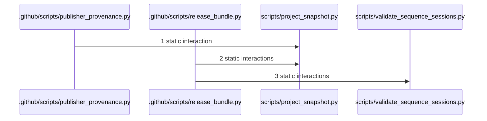

<!-- GENERATED BY SEQUENCE HUMAN VIEW - DO NOT EDIT -->

# SW2-26-GOVERNANCE — Human Sequence View

> This diagram is a deterministic **static structural projection**. It collapses helper-level calls into semantic modules for readability. It does **not** prove runtime ordering and does not replace the full machine evidence.

## Evidence

- Machine graph: [docs/sequence/generated/SW2-26-GOVERNANCE.actual.json](../../../docs/sequence/generated/SW2-26-GOVERNANCE.actual.json)
- Full machine Mermaid: [docs/sequence/generated/SW2-26-GOVERNANCE.actual.mmd](../../../docs/sequence/generated/SW2-26-GOVERNANCE.actual.mmd)
- Human projection data: [docs/sequence/generated/SW2-26-GOVERNANCE.human.json](../../../docs/sequence/generated/SW2-26-GOVERNANCE.human.json)
- Source digest: `19632f1e23266dacfdd3c0e033322a92f7ff5b47e14bc7c90cd2fb01e62fcf6d`

## Complexity

| Metric | Machine | Human |
|---|---:|---:|
| Participants / nodes | 24 | 4 |
| Interactions / edges | 41 | 3 |
| Internal machine edges collapsed | 35 | — |
| Cross-component edges aggregated | 3 | — |

Policy `module-collapse-v1`: one participant per semantic module/external boundary and one rendered interaction per directed component pair. The ceilings are derived from the graph itself; this policy does not invent a global numeric readability limit.

## Diagram

